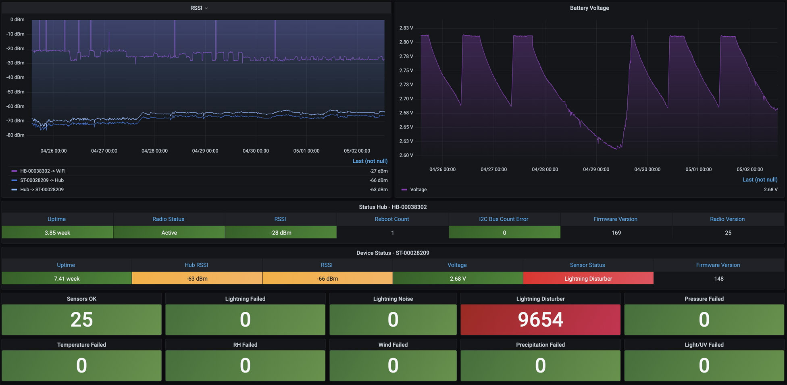
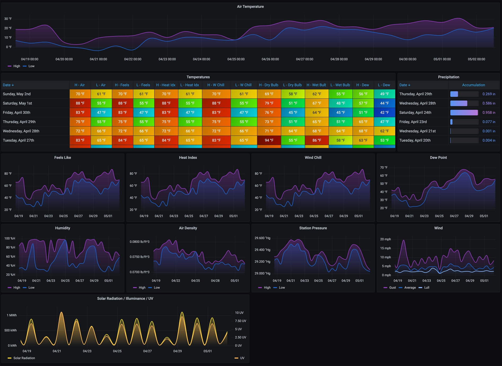
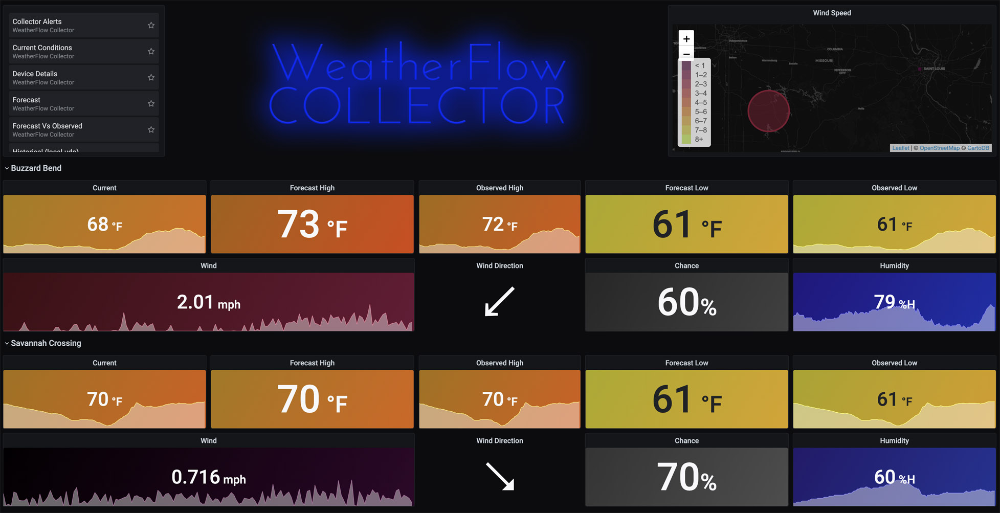
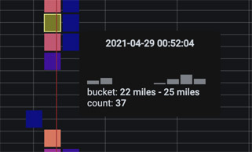
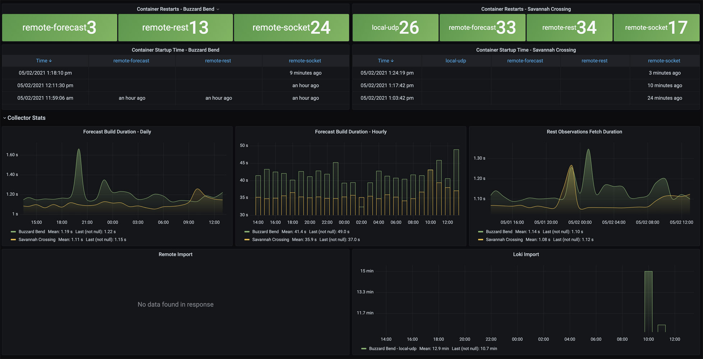
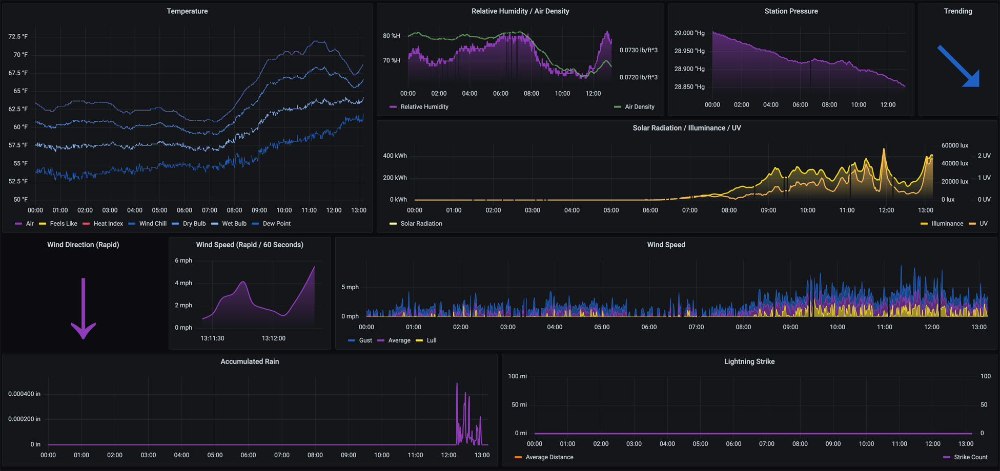

## About The Project

<center></center>

**weatherflow-collector** is an application that provides multiple ways of collecting data from the [WeatherFlow Tempest](https://weatherflow.com/tempest-weather-system/) weather system. Once deployed, this collection of Grafana dashboards will help visualize that data. If you're just getting started with Grafana, InfluxDB, and WeatherFlow Tempest, you may want to check out my [WeatherFlow Dashboards AIO](https://github.com/lux4rd0/weatherflow-dashboards-aio) (All In One) project. (It is still being updated.)

A live set of dashboards using this collector [are available](https://labs.lux4rd0.com/weatherflow-collector/) for you to try out.

## Getting Started

The project is typically deployed as a Docker container, which requires configurations based on how and where you want to collect and store the data.

## Prerequisites

- [Docker](https://docs.docker.com/install)
- [Docker Compose](https://docs.docker.com/compose/install)
- [InfluxDB V2](https://docs.influxdata.com/influxdb/v2/)
- [Grafana 11.1.0](https://grafana.com/oss/grafana/)

## Notice

Version 5.1 is the most recent release of the collector, and it has been completely rewritten. However, there are still some issues that I am working on resolving. If you come across something that isn't working as expected or if you have suggestions for new features, please open an issue, and I will address it. I'm also updating the documentation as quickly as possible, as there's quite a big difference between versions. 

## Deploying the WeatherFlow Collector

Use the following [Docker container](https://hub.docker.com/r/lux4rd0/weatherflow-collector):

    lux4rd0/weatherflow-collector:5.1.55
    lux4rd0/weatherflow-collector:latest
    
The provided container has a multi-architecture supporting both Linux/amd64 and Linux/arm64.

Correct environmental variables are required for the application to function. Below are the required minimum settings to get started:

    WEATHERFLOW_COLLECTOR_API_TOKEN
    WEATHERFLOW_COLLECTOR_INFLUXDB_URL
    WEATHERFLOW_COLLECTOR_INFLUXDB_TOKEN
    WEATHERFLOW_COLLECTOR_INFLUXDB_ORG
    WEATHERFLOW_COLLECTOR_INFLUXDB_BUCKET


#### `docker-compose.yml`

A minimal compose.yaml file would look like:

    name: weatherflow-collector-lux4rd0
    services:
      weatherflow-collector-lux4rd0:
        container_name: weatherflow-collector-lux4rd0
        environment:
          TZ: America/Chicago
          WEATHERFLOW_COLLECTOR_API_TOKEN: TOKEN
          WEATHERFLOW_COLLECTOR_INFLUXDB_BUCKET: weatherflow
          WEATHERFLOW_COLLECTOR_INFLUXDB_ORG: Lux4rd0
          WEATHERFLOW_COLLECTOR_INFLUXDB_TOKEN: TOKEN
          WEATHERFLOW_COLLECTOR_INFLUXDB_URL: http://weatherflow-collector.lux4rd0.com:8086
        image: lux4rd0/weatherflow-collector:latest
        network_mode: host
        restart: always

Running `docker compose up -d` will spin up the WeatherFlow Collector container.

If you want to run this as a docker run command, that would look like:

    docker run -d \
      --name weatherflow-collector-lux4rd0 \
      --env TZ=America/Chicago \
      --env WEATHERFLOW_COLLECTOR_API_TOKEN=TOKEN \
      --env WEATHERFLOW_COLLECTOR_INFLUXDB_BUCKET=weatherflow \
      --env WEATHERFLOW_COLLECTOR_INFLUXDB_ORG=Lux4rd0 \
      --env WEATHERFLOW_COLLECTOR_INFLUXDB_TOKEN=TOKEN \
      --env WEATHERFLOW_COLLECTOR_INFLUXDB_URL=http://weatherflow-collector.lux4rd0.com:8086 \
      --network host \
      --restart always \
      lux4rd0/weatherflow-collector:latest

#### Optional Export Command (Still under rework with version 5.1):

If you want to export your data from the WeatherFlow cloud, run this Docker command substituting your own token:

    docker run --rm \
      --name=weatherflow-collector-remote-export \
      -e WEATHERFLOW_COLLECTOR_COLLECTOR_TYPE=remote-export \
      -e WEATHERFLOW_COLLECTOR_FUNCTION=export \
      -e WEATHERFLOW_COLLECTOR_API_TOKEN=your_api_token \
      -e WEATHERFLOW_COLLECTOR_EXPORT_DAYS=20 \
      -v $(pwd):/weatherflow-collector/export \
      lux4rd0/weatherflow-collector:latest

Files will be created in your current working directory that look something like this:

    weatherflow-collector_export-station_351-device_26040.csv
    weatherflow-collector_export-station_351-device_16029.csv

#### Optional Import Command (Still under rework with version 5.1):

If you want to import your data from the WeatherFlow cloud, run this Docker command substituting your own token:

    docker run --rm \
      --name=weatherflow-collector-remote-export \
      -e WEATHERFLOW_COLLECTOR_COLLECTOR_TYPE=remote-export \
      -e WEATHERFLOW_COLLECTOR_FUNCTION=export \
      -e WEATHERFLOW_COLLECTOR_API_TOKEN=your_api_token \
      -e WEATHERFLOW_COLLECTOR_IMPORT_DAYS=20 \
      lux4rd0/weatherflow-collector:latest

Files will be created in your current working directory that look something like this:

    weatherflow-collector_export-station_351-device_26040.csv
    weatherflow-collector_export-station_351-device_16029.csv


## Environmental flags:

````WEATHERFLOW_COLLECTOR_API_TOKEN````

Your WeatherFlow API token.

````WEATHERFLOW_COLLECTOR_API_RATE_LIMIT````

The rate limit for API requests (default: 15).

````WEATHERFLOW_COLLECTOR_API_DATA_SAVE_DIR````

The base directory where you can save your API data (default: "api_data_saver").

````WEATHERFLOW_COLLECTOR_CONFIG_FILE````

The configuration file path for WeatherFlow stations (default: "conf/weatherflow_station.conf").

````WEATHERFLOW_COLLECTOR_PRIMARY_SOURCE````

Primary source for data collection (default: "collector_websocket").

````WEATHERFLOW_COLLECTOR_UDP_BUFFER_SIZE````

UDP buffer size (default: 4096).

````WEATHERFLOW_COLLECTOR_UDP_COLLECTOR_MAX_RETRIES````

Maximum retries for UDP collector (default: 5).

````WEATHERFLOW_COLLECTOR_UDP_COLLECTOR_PORT````

Port for UDP collector (default: 50222).

````WEATHERFLOW_COLLECTOR_UDP_COLLECTOR_RETRY_DELAY````

Retry delay for UDP collector (default: 5).

````WEATHERFLOW_COLLECTOR_UDP_LISTEN_ADDRESS````

Listen address for UDP (default: "0.0.0.0").

````WEATHERFLOW_COLLECTOR_PROVIDER_WEBSOCKET_SERVER_CLEANUP_CONNECTIONS_INTERVAL````

Cleanup interval for WebSocket server connections (default: 60).

````WEATHERFLOW_COLLECTOR_PROVIDER_WEBSOCKET_SERVER_MAX_CONNECTIONS````

Maximum connections for WebSocket server (default: 100).

````WEATHERFLOW_COLLECTOR_PROVIDER_WEBSOCKET_SERVER_PING_INTERVAL````

Ping interval for WebSocket server (default: 30).

````WEATHERFLOW_COLLECTOR_PROVIDER_WEBSOCKET_SERVER_PING_TIMEOUT````

Ping timeout for WebSocket server (default: 10).

````WEATHERFLOW_COLLECTOR_PROVIDER_WEBSOCKET_SERVER_HOST````

Host for WebSocket server (default: "0.0.0.0").

````WEATHERFLOW_COLLECTOR_PROVIDER_WEBSOCKET_SERVER_PORT````

Port for WebSocket server (default: 6789).

````WEATHERFLOW_COLLECTOR_PROVIDER_WEBSOCKET_RETRY_DELAY````

Retry delay for WebSocket provider (default: 1).

````WEATHERFLOW_COLLECTOR_PROVIDER_WEBSOCKET_MAX_DELAY````

Maximum delay for WebSocket provider (default: 60).

````WEATHERFLOW_COLLECTOR_PROVIDER_WEBSOCKET_MAX_RETRIES````

Maximum retries for WebSocket provider (default: 20).

````WEATHERFLOW_COLLECTOR_COLLECTOR_WEBSOCKET_RETRY_DELAY````

Retry delay for WebSocket collector (default: 1).

````WEATHERFLOW_COLLECTOR_COLLECTOR_WEBSOCKET_MAX_DELAY````

Maximum delay for WebSocket collector (default: 60).

````WEATHERFLOW_COLLECTOR_COLLECTOR_WEBSOCKET_MAX_RETRIES````

Maximum retries for WebSocket collector (default: 20).

````WEATHERFLOW_COLLECTOR_INFLUXDB_URL````

URL for InfluxDB.

````WEATHERFLOW_COLLECTOR_INFLUXDB_TOKEN````

Token for InfluxDB.

````WEATHERFLOW_COLLECTOR_INFLUXDB_ORG````

Organization for InfluxDB.

````WEATHERFLOW_COLLECTOR_INFLUXDB_BUCKET````

Bucket for InfluxDB.

````WEATHERFLOW_COLLECTOR_MYSQL_USER````

MySQL user.

````WEATHERFLOW_COLLECTOR_MYSQL_PASSWORD````

MySQL password.

````WEATHERFLOW_COLLECTOR_MYSQL_HOST````

MySQL host.

````WEATHERFLOW_COLLECTOR_MYSQL_DATABASE````

MySQL database.

````WEATHERFLOW_COLLECTOR_STORAGE_INFLUXDB_BATCH_SIZE````

Batch size for InfluxDB storage (default: 2000).

````WEATHERFLOW_COLLECTOR_STORAGE_INFLUXDB_FLUSH_INTERVAL````

Flush interval for InfluxDB storage (default: 1000).

````WEATHERFLOW_COLLECTOR_STORAGE_INFLUXDB_JITTER_INTERVAL````

Jitter interval for InfluxDB storage (default: 0).

````WEATHERFLOW_COLLECTOR_STORAGE_INFLUXDB_MAX_CLOSE_WAIT````

Maximum close wait for InfluxDB storage (default: 300000).

````WEATHERFLOW_COLLECTOR_STORAGE_INFLUXDB_MAX_RETRIES````

Maximum retries for InfluxDB storage (default: 5).

````WEATHERFLOW_COLLECTOR_STORAGE_INFLUXDB_MAX_RETRY_DELAY````

Maximum retry delay for InfluxDB storage (default: 125000).

````WEATHERFLOW_COLLECTOR_STORAGE_INFLUXDB_MAX_RETRY_TIME````

Maximum retry time for InfluxDB storage (default: 180000).

````WEATHERFLOW_COLLECTOR_STORAGE_INFLUXDB_RETRY_INTERVAL````

Retry interval for InfluxDB storage (default: 5000).

````WEATHERFLOW_COLLECTOR_STORAGE_INFLUXDB_TIMEOUT````

Timeout for InfluxDB storage (default: 30000).

````WEATHERFLOW_COLLECTOR_EVENT_MANAGER_MAX_RETRIES````

Maximum retries for event manager (default: 5).

````WEATHERFLOW_COLLECTOR_EVENT_MANAGER_RETRY_DELAY````

Retry delay for event manager (default: 1).

````WEATHERFLOW_COLLECTOR_LOG_DIRECTORY````

Directory for logs (default: "logs").

````WEATHERFLOW_COLLECTOR_COLLECTOR_EXPORT_ENABLED````

Enable collector export (default: False).

````WEATHERFLOW_COLLECTOR_STORAGE_FILE_ENABLED````

Enable file storage (default: False).

````WEATHERFLOW_COLLECTOR_STORAGE_INFLUXDB_ENABLED````

Enable InfluxDB storage (default: True).

````WEATHERFLOW_COLLECTOR_COLLECTOR_REST_EXPORT_ENABLED````

Enable REST export (default: False).

````WEATHERFLOW_COLLECTOR_COLLECTOR_REST_FORECASTS_ENABLED````

Enable REST forecasts (default: True).

````WEATHERFLOW_COLLECTOR_COLLECTOR_REST_IMPORT_ENABLED````

Enable REST import (default: False).

````WEATHERFLOW_COLLECTOR_COLLECTOR_REST_OBSERVATIONS_DEVICE_ENABLED````

Enable REST observations for devices (default: True).

````WEATHERFLOW_COLLECTOR_COLLECTOR_REST_OBSERVATIONS_STATION_ENABLED````

Enable REST observations for stations (default: False).

````WEATHERFLOW_COLLECTOR_COLLECTOR_REST_STATS_ENABLED````

Enable REST stats (default: True).

````WEATHERFLOW_COLLECTOR_SYSTEM_METRICS_ENABLED````

Enable system metrics (default: True).

````WEATHERFLOW_COLLECTOR_COLLECTOR_UDP_ENABLED````

Enable UDP collector (default: True).

````WEATHERFLOW_COLLECTOR_COLLECTOR_WEBSOCKET_ENABLED````

Enable WebSocket collector (default: True).

````WEATHERFLOW_COLLECTOR_PROVIDER_WEBSOCKET_SERVER_ENABLED````

Enable WebSocket server provider (default: True).

````WEATHERFLOW_COLLECTOR_HANDLER_ENABLED````

Enable handler (default: True).

````WEATHERFLOW_COLLECTOR_HANDLER_REST_STATS_SUPPRESS_WARNINGS_ENABLED````

Suppress REST stats warnings (default: True).

````WEATHERFLOW_COLLECTOR_STORAGE_FILE_COLLECTOR_REST_FORECASTS_ENABLED````

Enable file storage for REST forecasts (default: False).

````WEATHERFLOW_COLLECTOR_STORAGE_FILE_COLLECTOR_REST_IMPORT_ENABLED````

Enable file storage for REST import (default: False).

````WEATHERFLOW_COLLECTOR_STORAGE_FILE_COLLECTOR_REST_EXPORT_ENABLED````

Enable file storage for REST export (default: False).

````WEATHERFLOW_COLLECTOR_STORAGE_FILE_COLLECTOR_REST_OBSERVATIONS_DEVICE_ENABLED````

Enable file storage for REST observations (device) (default: False).

````WEATHERFLOW_COLLECTOR_STORAGE_FILE_COLLECTOR_REST_OBSERVATIONS_STATION_ENABLED````

Enable file storage for REST observations (station) (default: False).

````WEATHERFLOW_COLLECTOR_STORAGE_FILE_STATIONCONFIG_ENABLED````

Enable file storage for station configuration (default: False).

````WEATHERFLOW_COLLECTOR_STORAGE_FILE_COLLECTOR_UDP_ENABLED````

Enable file storage for UDP collector (default: False).

````WEATHERFLOW_COLLECTOR_STORAGE_FILE_COLLECTOR_WEBSOCKET_ENABLED````

Enable file storage for WebSocket collector (default: False).

````WEATHERFLOW_COLLECTOR_STORAGE_FILE_COLLECTOR_REST_STATS_ENABLED````

Enable file storage for REST stats (default: False).

````WEATHERFLOW_COLLECTOR_ENABLE_INFLUXDB_DATA_STRUCTURE_TRACKING````

Enable InfluxDB data structure tracking (default: False).

````WEATHERFLOW_COLLECTOR_ENABLE_INFLUXDB_DATA_STRUCTURE_TRACKING_EXPORT_INTERVAL````

The export interval for InfluxDB data structure tracking (default: 60).

````WEATHERFLOW_COLLECTOR_ENABLE_INFLUXDB_DATA_STRUCTURE_TRACKING_SAVE_DIR````

The save directory for InfluxDB data structure tracking (default: "logs").

````WEATHERFLOW_COLLECTOR_EXPORT_COLLECTOR_STALE_SEGMENT_DAYS````

Stale segment days for export collector (default: 30).

````WEATHERFLOW_COLLECTOR_REST_EXPORT_FETCH_OBSERVATIONS_WORKERS````

Workers for REST export fetch observations (default: 4).

````WEATHERFLOW_COLLECTOR_COLLECTOR_REST_OBSERVATIONS_INTERVAL````

Interval for REST observations (default: 60).

````WEATHERFLOW_COLLECTOR_COLLECTOR_REST_IMPORT_FETCH_WORKERS````

Fetch workers for REST import (default: 16).

````WEATHERFLOW_COLLECTOR_COLLECTOR_REST_FORECASTS_FETCH_INTERVAL````

Fetch interval for REST forecasts (default: 60).

````WEATHERFLOW_COLLECTOR_COLLECTOR_REST_IMPORT_FETCH_OBSERVATIONS_DELAY_MS````

Fetch observations delay for REST import (default: 200).

````WEATHERFLOW_COLLECTOR_STORAGE_INFLUXDB_WORKERS````

Workers for InfluxDB storage (default: 8).

````WEATHERFLOW_COLLECTOR_COLLECTOR_REST_IMPORT_BATCH_SIZE````

Batch size for REST import (default: 2000).

````WEATHERFLOW_COLLECTOR_UTILS_HTTP_FETCH_RETRIES````

HTTP fetch retries (default: 3).

````WEATHERFLOW_COLLECTOR_UTILS_HTTP_FETCH_RETRY_WAIT````

Retry wait for HTTP fetch (default: 2).

````WEATHERFLOW_COLLECTOR_UTILS_HTTP_FETCH_TIMEOUT````

Timeout for HTTP fetch (default: 30).

````WEATHERFLOW_COLLECTOR_HEALTHCHECK_WEBSOCKETCOLLECTOR_TIMEOUT_SOCKET````

The parameter defines the maximum duration the WeatherFlow Collector WebSocket Client will wait without receiving any data before considering the connection inactive. If no data is received within this specified timeout period, the WebSocket connection is closed and re-established to ensure continuous data flow and system reliability (default: 60).

````WEATHERFLOW_COLLECTOR_ENABLE_HEALTHCHECK_FORECAST````

Enable health check for forecast (default: True).

````WEATHERFLOW_COLLECTOR_ENABLE_HEALTHCHECK_REST````

Enable health check for REST (default: True).

````WEATHERFLOW_COLLECTOR_ENABLE_HEALTHCHECK_SOCKET````

Enable health check for socket (default: True).

````WEATHERFLOW_COLLECTOR_ENABLE_HEALTHCHECK_UDP````

Enable health check for UDP (default: True).

````WEATHERFLOW_COLLECTOR_HEALTHCHECK_INTERVAL_FORECAST````

Health check interval for forecast (default: 15).

````WEATHERFLOW_COLLECTOR_HEALTHCHECK_INTERVAL_REST````

Health check interval for REST (default: 60).

````WEATHERFLOW_COLLECTOR_HEALTHCHECK_INTERVAL_SOCKET````

Health check interval for socket (default: 5).

````WEATHERFLOW_COLLECTOR_HEALTHCHECK_INTERVAL_UDP````

Health check interval for UDP (default: 10).

````WEATHERFLOW_COLLECTOR_HEALTHCHECK_RECONNECT_SOCKET````

Reconnect interval for socket (default: 60).

````WEATHERFLOW_COLLECTOR_HEALTHCHECK_RELISTEN_SOCKET````

Relisten interval for socket (default: 10).

````WEATHERFLOW_COLLECTOR_HEALTHCHECK_RETRY_DELAY_SOCKET````

Retry delay for socket (default: 120).

````WEATHERFLOW_COLLECTOR_HEALTHCHECK_STARTUP_DELAY_FORECAST````

Startup delay for forecast health check (default: 60).

````WEATHERFLOW_COLLECTOR_HEALTHCHECK_STARTUP_DELAY_REST````

Startup delay for REST health check (default: 120).

````WEATHERFLOW_COLLECTOR_HEALTHCHECK_STARTUP_DELAY_SOCKET````

Startup delay for socket health check (default: 60).

````WEATHERFLOW_COLLECTOR_HEALTHCHECK_STARTUP_DELAY_UDP````

Startup delay for UDP health check (default: 60).

````WEATHERFLOW_COLLECTOR_HEALTHCHECK_THRESHOLD_FORECAST````

Threshold for forecast health check (default: 3000).

````WEATHERFLOW_COLLECTOR_HEALTHCHECK_THRESHOLD_REST````

Threshold for REST health check (default: 60).

````WEATHERFLOW_COLLECTOR_HEALTHCHECK_THRESHOLD_SOCKET````

Threshold for socket health check (default: 900).

````WEATHERFLOW_COLLECTOR_HEALTHCHECK_THRESHOLD_UDP````

Threshold for UDP health check (default: 10).

````WEATHERFLOW_COLLECTOR_ENABLE_O11Y_FORECAST````


Threshold for O11y UDP (default: 10).

````WEATHERFLOW_COLLECTOR_ENABLE_IMPORT_EXPORT_CACHE````

Enable import/export cache (default: True).

````WEATHERFLOW_COLLECTOR_ENABLE_IMPORT_EXPORT_CACHE_EXCLUDE_RECENT_HOURS````

Exclude recent hours from import/export cache (default: True).

````WEATHERFLOW_COLLECTOR_PROCESSOR_EXPORT_BUCKET````

Export bucket for processor (default: "month").

````WEATHERFLOW_COLLECTOR_PROCESSOR_EXPORT_FOLDER````

Export folder for processor (default: "export").

````WEATHERFLOW_COLLECTOR_PROCESSOR_EXPORT_WORKERS````

Workers for processor export (default: 8).

````WEATHERFLOW_COLLECTOR_PROCESSOR_EXPORT_TYPE````

Export type for processor (default: "csv").

````WEATHERFLOW_COLLECTOR_PROCESSOR_EXPORT_CACHE_EXCLUDE_RECENT_HOURS````

Exclude recent hours from processor export cache (default: 48).

````WEATHERFLOW_COLLECTOR_PROCESSOR_EXPORT_CACHE_FOLDER````

Cache folder for processor export (default: "cache").

````WEATHERFLOW_COLLECTOR_PROCESSOR_EXPORT_CACHE_TTL````

Cache TTL for processor export (default: 7200).

````WEATHERFLOW_COLLECTOR_LOGGER_CONSOLE_USE_COLOR_ENABLED````

Enable color for console logger (default: True).

````WEATHERFLOW_COLLECTOR_LOGGER_CONSOLE_ENABLED````

Enable console logger (default: True).

````WEATHERFLOW_COLLECTOR_LOGGER_FILE_USE_COLOR_ENABLED````

Enable color for file logger (default: False).

````WEATHERFLOW_COLLECTOR_LOGGER_FILE_ENABLED````

Enable file logger (default: False).

#### *Note - If a change is made to the location details of your WeatherFlow device (such as station name, public name, longitude, latitude, etc.) - please restart the docker container to pick up the changes.

## Obtaining Your Tempest Authentication Token

You can obtain this by signing in to the Tempest Web App at [tempestwx.com](https://tempestwx.com/) and then going to Settings -> Data Authorizations -> Create Token.

## Collector Details

#### remote-socket

This setting grabs all of the metrics from your Tempest and all of the [derived metrics](https://weatherflow.github.io/Tempest/api/derived-metric-formulas.html), accomplished with WeatherFlow backend AI systems. The metrics don't have the same metrics resolution as the local-udp collector but support lightning suppression, sea level pressure adjustments, and additional events such as online and offline status.

#### remote-rest

This setting is similar to the remote socket for obtaining WeatherFlow observations but only pulls data from a REST call once a minute (configurable). This collector also provides a few additional metrics, such as sea level pressure. I'm still figuring out which metrics make sense and which polling mechanism to implement, so I'm trying out both!

#### local-udp

This setting provides a listener on UDP port 50222 for messages coming from your Tempest hub. It provides all of the raw observation details and details on the Hub and Tempest, such as RSSI Wi-Fi details, uptime, sensor details, and device battery voltage. The observation metrics have a slightly higher data resolution than the REST/Socket API calls provide. However, it does not give any of the [derived metrics](https://weatherflow.github.io/Tempest/api/derived-metric-formulas.html) available with the REST/Socket API calls.

#### remote-forecast

This setting populates the WeatherFlow Forecast dashboards by polling the daily and hourly forecasts for your location and storing them in InfluxDB. The forecasting process runs on startup and every quarter-hour—00, 15, 30, and 45 minutes.

#### remote-import

This setting populates the WeatherFlow local-udp metrics from the WeatherFlow Cloud.


## Grafana Dashboards

Collecting data is only half the fun. Now it's time to provision some Grafana Dashboards to visualize your great WeatherFlow data. You'll find a [folder of dashboards](https://github.com/lux4rd0/weatherflow-collector/tree/main/dashboards) with collectors and backends split out. You can also use the links/numbers next to each dashboard title to load the dashboards [directly from Grafana](https://grafana.com/grafana/dashboards?search=weatherflow%20collector).

### Current Conditions - [14376](https://grafana.com/grafana/dashboards/14376)

<center></center>

This dashboard provides a comprehensive overview of your station location, combining all "at-a-glance" metrics from your WeatherFlow device. The current conditions dashboard is divided up into:

- **Temperature & Wind**: observed, feels like, forecast high and low, the chance of precipitation, humidity, sea level pressure, UV, wind speed, and direction.

- **Sunrise & Sunset and Sky Conditions**

- **Temperature & Brightness**: Heat index, wind chill, dry bulb, wet bulb, dew point, station pressure, brightness, solar radiation, and air density.

- **Rain & Lightning**: Rain accumulation (today and yesterday), rain duration (today and yesterday), lightning last detected, last distance, and the number of lightning detections during the previous 3 hours.

### Device Details - [14378](https://grafana.com/grafana/dashboards/14378)

<center></center>

This dashboard provides the current status for the Tempest and your WeatherFlow hub, such as Uptime, Radio Status, RSSI, Reboot Count, I2C Bus Count Error, Radio Version, Network ID, Firmware Version, and Voltage.

RSSI and Battery Voltage over time defaulted to the last seven days are shown at the top of the dashboard, while current device details are shown below.

Sensor Status measurements are shown with a number related to each per-minute collection from the device. Either "Sensors OK" is down or any failures, which sensor had the error. Note that if you have the Lightning Disturber enabled, you may see many failures as electromagnetic interference is being suppressed.

### Forecast - [14380](https://grafana.com/grafana/dashboards/14380)

<center></center>

A daily and hourly forecast in table format with charts below them. The default time range includes the current day and nine upcoming days. The interval drop-down at the top defaults to 12 hours to provide for highs and lows forecasts. Clicking on any of the dates in the "Forecast - Daily" table will refresh the Forecast hourly table to that day's hourly forecasts. This can also be done from the top "Forecast Day" drop-down menu.

### Forecast Vs. Observed - [14379](https://grafana.com/grafana/dashboards/14379)

<center></center>

As forecast data is collected, this dashboard may be used to compare what was forecasted (by how many days out) versus the observed metric from your WeatherFlow device. Temperature, Humidity, Wind, and UV measurements are covered here. By default, "All" available forecast days are overlayed over the observed metric. You can choose "Days Out" from the top drop-down menu to compare individual forecasts.

### Historical (remote) - [14382](https://grafana.com/grafana/dashboards/14382)

<center></center>

This provides a place to view weather details over longer periods of time. It defaults to 30 days with a 12-hour interval to show highs and lows for each Air Temperature, Humidity, Station Pressure, Solar, and Wind metrics. It includes [derived metrics](https://weatherflow.github.io/Tempest/api/derived-metric-formulas.html) as well as Feels Like, Heat Index, Wind Chill, Dry Bulb, Wet Bulb, and Dew Point. Precipitation Accumulation is displayed for any day that precipitation is detected.

### Overview - [14383](https://grafana.com/grafana/dashboards/14383)

<center></center>

Overview is the default landing page for the WeatherFlow Collector AIO. It provides an overview of current weather metrics and live updates on wind and direction. You can choose other dashboards from the top right-hand dashboard panel or the top left-hand side drop-downs under "WeatherFlow Collector Dashboards."

### Rain and Lightning - [14384](https://grafana.com/grafana/dashboards/14384)

<center></center>

A historical view (defaulted to seven days) shows the precipitation rate and daily accumulation. As you zoom into the specific precipitation events, change the Interval drop-down to smaller increments (up to 1-minute collections) for finer rates.

For lightning, strikes and distance are shown in a heat map visualization. Time is across the x-axis, while the number of detected lightning strikes is bucketed by color (dark blue to yellow). The Y-axis shows the bucketed distances (up to 40 miles away). Hover over each square for a histogram of each strike/distance count.

<center></center>

### System Stats - [14385](https://grafana.com/grafana/dashboards/14385) (Not Currently Update)

<center></center>

This provides two different system metrics to understand the health of your weatherflow-collector. At the top shows which container is running and when it last started. A default Docker health check is enabled for each container that requires some data to be received and persisted every 60 seconds, or the container is marked unhealthy. This check happens every 5 seconds and will restart the container after three failed checks.

The second section shows how long it takes to receive and persist forecasts and observations.

 - **Forecast Build Duration** - Daily - between 1 and 2 seconds
 - **Forecast Build Duration** - Hourly - between 30 and 45 seconds (note - if this takes longer than 60 seconds, the Docker Health Check will currently recycle the container. A future update will change this to take a longer build duration into account. For now - set the "WEATHERFLOW_COLLECTOR_DOCKER_HEALTHCHECK_ENABLED" environmental variable to "false."
 - **Rest Observations** - between 1 and 2 seconds

### Today So Far - [14387](https://grafana.com/grafana/dashboards/14387)

<center></center>

This dashboard provides for the Temperature (Air, Feels Like, Heat Index, Wind Chill, Dry Bulb, Wet Bulb, Dew Point), Relative Humidity, Air Density, Station Pressure (with Trending), Accumulated Rain, Solar Radiation, Illuminance, UV, Lightning Strike, and Wind Speed from midnight to the current time. These reflect the WeatherFlow measurements from data sent to WeatherFlow and include [derived metrics](https://weatherflow.github.io/Tempest/api/derived-metric-formulas.html) in the response.

## Multiple Devices

The data collector and dashboards support multiple WeatherFlow Tempest devices.

### Time Zone Variable

A TZ variable is required when running the Docker containers. (It's populated automatically from the `generate_docker-compose.sh` scripts) 

TZ is specific to each hub/device location and is required as part of the InluxDB query to identify day breaks and other 12/24 hour interval groups. For dashboards with multiple devices in different time zones, you may need to correctly switch the time zones from the top drop-down to group midnight/noon periods.

## Roadmap

See the open issues for a list of proposed features (and known issues).

## Contact

Dave Schmid: [@lux4rd0](https://twitter.com/lux4rd0) - dave@pulpfree.org

Project Link: [https://github.com/lux4rd0/weatherflow-collector](https://github.com/lux4rd0/weatherflow-collector)

## Acknowledgements

- Grafana Labs - [https://grafana.com/](https://grafana.com/)
- Grafana - [https://grafana.com/oss/grafana/](https://grafana.com/oss/grafana/)
- Grafana Dashboard Community - [https://grafana.com/grafana/dashboards/](https://grafana.com/grafana/dashboards/)
