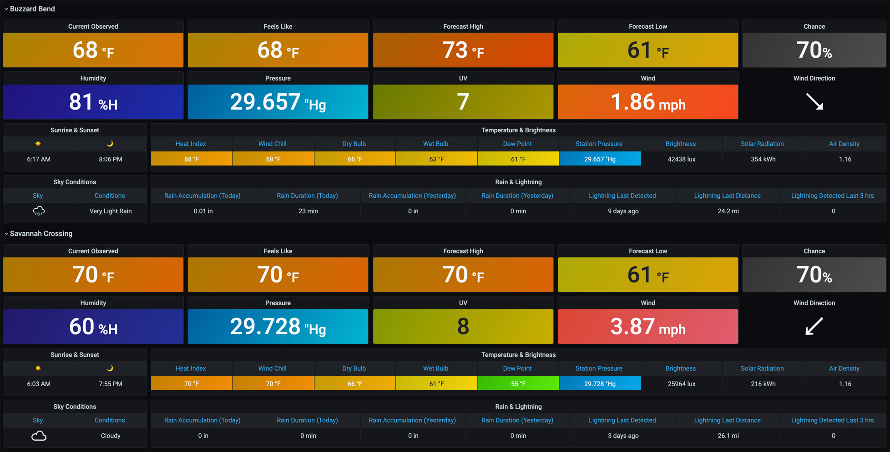
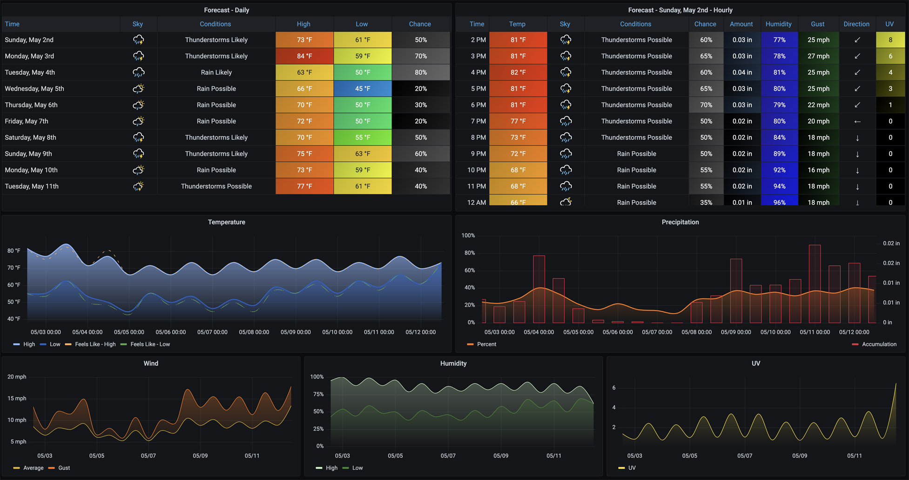
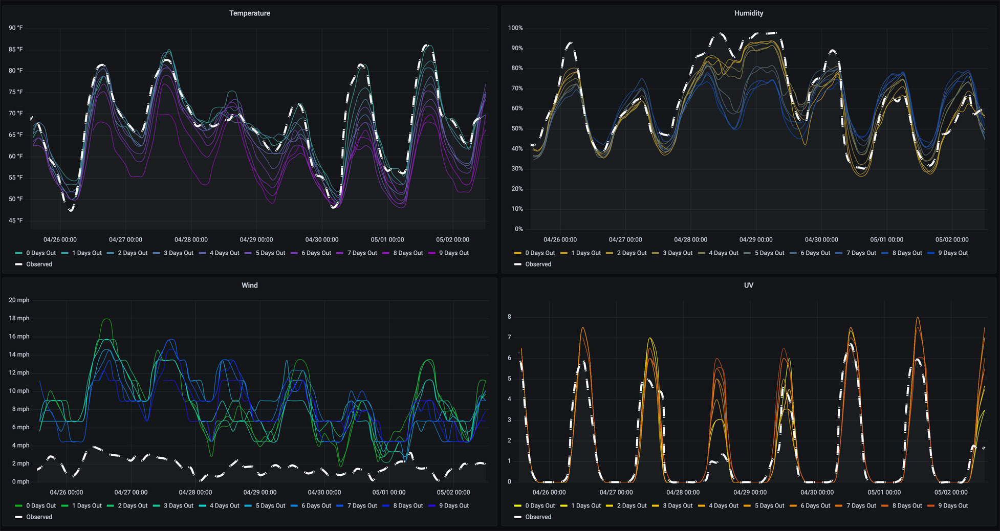
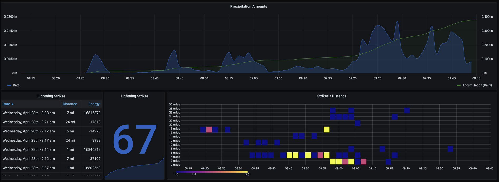
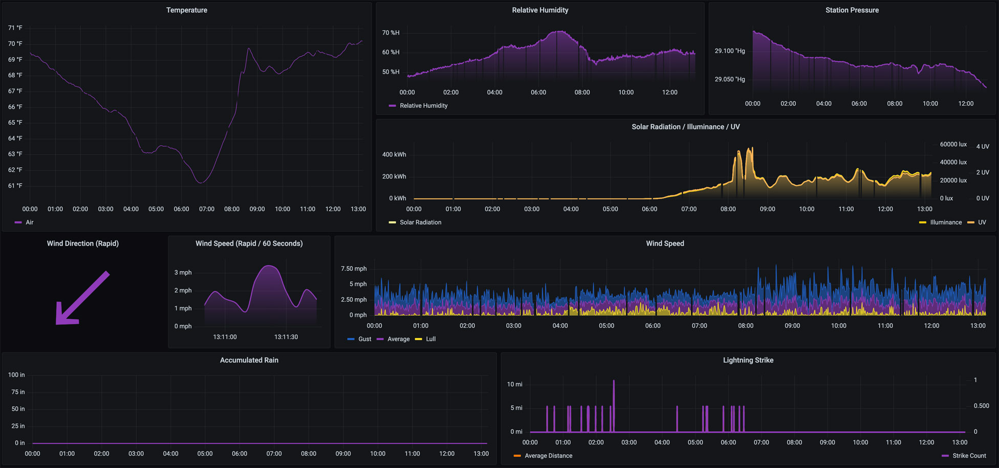

## About The Project

<center></center>


**weatherflow-collector** is a set of scripts deployed with Docker that provide multiple ways of collecting data from the [WeatherFlow Tempest](https://weatherflow.com/tempest-weather-system/) weather system. Once deployed, this collection of Grafana dashboards will help you start visualizing that data. If you're just getting started with Grafana, InfluxDB, and WeatherFlow Tempest - you may want to check out my [WeatherFlow Dashboards AIO](https://github.com/lux4rd0/weatherflow-dashboards-aio) (All In One) project.

A live set of dashboards using this collector [are available](https://labs.lux4rd0.com/weatherflow-collector/) for you to try out.

## Getting Started

The project builds a pre-configured Docker container that takes different configurations based on how you want to collect and where you want to store the data.

## Prerequisites

- [Docker](https://docs.docker.com/install)
- [Docker Compose](https://docs.docker.com/compose/install)
- [InfluxDB 1.8](https://docs.influxdata.com/influxdb/v1.8/) or [Grafana Loki 2.2](https://grafana.com/oss/loki/)
- [Grafana 8.0.2](https://grafana.com/oss/grafana/)

## Notice

Like all projects - weatherflow-collector is always in a flux state based on trying out new things and seeing what works and what doesn't work. It started as a fun exercise to visualize "what's possible," and I'm experimenting with different collectors and backends. Please expect breaking changes along the way.

## Deploying the WeatherFlow Collector

Use the following [Docker container](https://hub.docker.com/r/lux4rd0/weatherflow-collector):

    lux4rd0/weatherflow-collector:3.2.0
    lux4rd0/weatherflow-collector:latest
    
Correct environmental variables are required for the container to function. The following script may be used:

    generate_docker-compose.sh

The script takes the following details about your InfluxDB and your WeatherFlow token as environmental variables:

    WEATHERFLOW_COLLECTOR_IMPORT_DAYS #optional
    WEATHERFLOW_COLLECTOR_INFLUXDB_PASSWORD
    WEATHERFLOW_COLLECTOR_INFLUXDB_URL
    WEATHERFLOW_COLLECTOR_INFLUXDB_USERNAME
    WEATHERFLOW_COLLECTOR_LOKI_CLIENT_URL #optional
    WEATHERFLOW_COLLECTOR_PERF_INTERVAL #option
    WEATHERFLOW_COLLECTOR_THREADS #optional
    WEATHERFLOW_COLLECTOR_TOKEN

An example command line would be:

    WEATHERFLOW_COLLECTOR_IMPORT_DAYS="365" \
    WEATHERFLOW_COLLECTOR_INFLUXDB_PASSWORD="4L851Jtjaasdset7AJoFasdoFYR3di5Zniew28" \
    WEATHERFLOW_COLLECTOR_INFLUXDB_URL="http://influxdb01.com:8086/write?db=weatherflow" \
    WEATHERFLOW_COLLECTOR_INFLUXDB_USERNAME="influxdb" \
    WEATHERFLOW_COLLECTOR_PERF_INTERVAL="60" \
    WEATHERFLOW_COLLECTOR_THREADS="4" \
    WEATHERFLOW_COLLECTOR_TOKEN="a22afsa7-0dcc-4918-9f9a-923dfd339f41c" \
    bash ./generate_docker-compose.sh

The following files will be generated for you:

#### `docker-compose.yml`

Running `docker-compose up -d' will spin up several containers for each of the types of data collectors (listed below). If you have more than one hub on your account - please edit the `docker-compose.yml` file to only have your hub local to your network. If you have more than one device, those will also be added and can remain.

#### Optional:
#### `remote-import-<<station_name>>.sh`

This script will spin up a docker container to import all of the observed metrics from the WeatherFlow cloud. Having an import function may be helpful if you're starting with this WeatherFlow Collector or if you've reset your InfluxDB database. This script essentially loads whatever is in the WeatherFlow cloud and imports it as your locally collected UDP data. If you have more than one device, a separate import file will be generated for each.

## Environmental flags:

````WEATHERFLOW_COLLECTOR_BACKEND_TYPE````

- influxdb (supports local-udp, remote-rest (forecasts), and remote-socket (observations)
- loki (supports local-udp and remote-socket (observations) *(Currently disabled)*

````WEATHERFLOW_COLLECTOR_COLLECTOR_TYPE````

- [local-udp](https://weatherflow.github.io/Tempest/api/udp.html)
- [remote-forecast](https://weatherflow.github.io/Tempest/api/swagger/#/forecast/)
- [remote-rest](https://weatherflow.github.io/Tempest/api/swagger/#/observations/)
- [remote-socket](https://weatherflow.github.io/Tempest/api/ws.html)
- remote-import
- host-performance

````WEATHERFLOW_COLLECTOR_DEBUG````

- false
- true

````WEATHERFLOW_COLLECTOR_DEVICE_ID````

The Device ID of your Tempest

````WEATHERFLOW_COLLECTOR_ELEVATION````

The Elevation of your Tempest

````WEATHERFLOW_COLLECTOR_FORECAST_INTERVAL````

How often (in seconds) forecast data is collected from WeatherFlow. Defaults to 60 seconds if not set.

````WEATHERFLOW_COLLECTOR_FUNCTION````

- collector
- import

````WEATHERFLOW_COLLECTOR_DOCKER_HEALTHCHECK_ENABLED````

- false
- true

A Docker health check function that runs every 60 seconds. If no data has been collected or persisted to InfluxDB and this parameter is set to true, the docker container will be marked as Unhealthy and terminate. Setting this to false will always return a healthy response to the Docker health check. The health check is included because there may be times where the local UDP listener or remote-socket connection goes silent, and recycling of the container is the only way to get it listening again. You may also find the remote-forecast container takes longer than 60 seconds to complete its hourly forecast transformation. A future update will change the 60 seconds to be a multiple of the interval rate rather than a fixed 60 seconds.

````WEATHERFLOW_COLLECTOR_HOST_HOSTNAME````

This value represents the hostname that is running the Docker containers. Docker creates a unique hostname each time a docker container is recycled. This entry is used in the management dashboards to know where your collectors are running. It's also helpful if you run the collector across multiple hosts. This value is populated when the `generate_docker-compose.sh` script generates the `docker-compose.yml` file.

````WEATHERFLOW_COLLECTOR_HUB_SN````

The WeatherFlow Hub serial number.

````WEATHERFLOW_COLLECTOR_IMPORT_DAYS````

The number of days you want to import from either the WeatherFlow cloud or Grafana Loki.

````WEATHERFLOW_COLLECTOR_INFLUXDB_PASSWORD````

The password for your InfluxDB

````WEATHERFLOW_COLLECTOR_INFLUXDB_URL````

The URL connection string for your InfluxDB. For example: http://influxdb:8086/write?db=weatherflow

````WEATHERFLOW_COLLECTOR_INFLUXDB_USERNAME````

The username of your InfluxDB

````WEATHERFLOW_COLLECTOR_LATITUDE````

The latitude of your WeatherFlow device.

````WEATHERFLOW_COLLECTOR_LOGCLI_URL````

The URL for your Grafana Loki instance. This parameter is used for importing back from Loki. For example: http://loki.3100/

````WEATHERFLOW_COLLECTOR_LOKI_CLIENT_URL````

The URL connection string for your Grafana Loki endpoint. For example: http://loki:3100/loki/api/v1/push

````WEATHERFLOW_COLLECTOR_LONGITUDE````

The longitude of your WeatherFlow device.

````WEATHERFLOW_COLLECTOR_PERF_INTERVAL````

How often (in seconds) the host-performance container polls your host for performance metrics. Defaults to 60 seconds if not set.

````WEATHERFLOW_COLLECTOR_PUBLIC_NAME````

The Public Name of your WeatherFlow device.

````WEATHERFLOW_COLLECTOR_REST_INTERVAL````

How often (in seconds) observation data is collected from WeatherFlow. Defaults to 60 seconds if not set.

````WEATHERFLOW_COLLECTOR_STATION_ID````

The Station ID of your Tempest

````WEATHERFLOW_COLLECTOR_STATION_NAME````

The Station Name of your WeatherFlow device.

````WEATHERFLOW_COLLECTOR_THREADS````

The number of threads used when populating the Forecast Hourly details or importing WeatherFlow Cloud or Grafana Loki logs. Defaults to 4 threads if not set. This likely should align with the number of CPUs that you have.

````WEATHERFLOW_COLLECTOR_TOKEN````

The WeatherFlow Personal Access Token.

#### *Note - If a change is made to the location details of your WeatherFlow device (such as station name, public name, longitude, latitude, etc.) - please rerun the `generate_docker-compose.sh` script or manually update the environmental variables to match.*

## Obtaining Your Tempest Authentication Token

 You can obtain this by signing in to the Tempest Web App at [tempestwx.com](https://tempestwx.com/), then go to Settings -> Data Authorizations -> Create Token.

## Collector Details

#### remote-socket

This setting grabs all of the metrics from your Tempest and all of the [derived metrics](https://weatherflow.github.io/Tempest/api/derived-metric-formulas.html), accomplished with WeatherFlow backend AI systems. The metrics don't have the same metrics resolution as the local-udp collector but supports lightning suppression and sea level pressure adjustments along with additional events such as online and offline status.

#### remote-rest

This setting is similar to the remote-socket for obtaining Weatherflow observations but only pulls data once a minute from a REST call. A few additional metrics are available on this collector, such as sea level pressure. Still working out which metrics make sense and the right kind of polling mechanism to put in place - so I'm trying out both!

#### local-udp

This setting provides a listener on UDP port 50222 for messages coming from your Tempest hub. It provides all of the raw observation details and details on the Hub and Tempest, such as RSSI Wifi details, uptime, sensor details, and device battery voltage. The observation metrics have a slightly higher resolution of data than the REST/Socket API calls provide. However, it does not give any of the [derived metrics](https://weatherflow.github.io/Tempest/api/derived-metric-formulas.html) available with the REST/Socket API calls.

#### remote-forecast

This setting populates the WeatherFlow Forecast dashboards by polling the daily and hourly forecasts for your location and stores them in InfluxDB. The forecasting process runs on startup and every quarter-hour - 00, 15, 30, and 45 minutes 

#### remote-import

This setting populates the WeatherFlow local-udp metrics from the WeatherFlow Cloud or logs stored in Grafana Loki.

#### host-performance

This optional container populates a few metrics about the performance of the host (or hosts). Metrics for CPU percentage, process queue, and memory are shown in the System Stats dashboard.

## Grafana Dashboards

Collecting data is only half the fun. Now it's time to provision some Grafana Dashboards to visualize all of your great WeatherFlow data. You'll find a [folder of dashboards](https://github.com/lux4rd0/weatherflow-collector/tree/main/dashboards) with collectors and backends split out. You can also use the links/numbers next to each dashboard title to load the dashboards in [directly from Grafana](https://grafana.com/grafana/dashboards?search=weatherflow%20collector).

### Alerts

<center></center>

Coming soon - a set of Grafana alerts to let you know of deviations in expected collector performance or weather metrics change.

### Current Conditions - [14376](https://grafana.com/grafana/dashboards/14376)

<center></center>

This dashboard provides a comprehensive overview of your station location, combining all "at-a-glance" metrics from your WeatherFlow device. The current conditions dashboard is divided up into:

- **Temperature & Wind**: observed, feels like, forecast high and low, the chance of precipitation, humidity, sea level pressure, UV, wind speed, and direction.)

- **Sunrise & Sunset and Sky Conditions**

- **Temperature & Brightness**: Heat index, wind chill, dry bulb, wet bulb, dew point, station pressure, brightness, solar radiation, and air density.

- **Rain & Lightning**: Rain accumulation (today and yesterday), rain duration (today and yesterday), lightning last detected, last distance, and the number of lightning detections during the previous 3 hours.

### Device Details - [14378](https://grafana.com/grafana/dashboards/14378)

<center></center>

This dashboard provides the current status for both the Tempest and your WeatherFlow hub, such as Uptime, Radio Status, RSSI, Reboot Count, I2C Bus Count Error, Radio Version, Network ID, Firmware Version, and Voltage.

RSSI and Battery Voltage over time defaulted to the last seven days are shown at the top of the dashboard, while current device details are shown below.

Sensor Status measurements are shown with a number related to each per minute collection from the device. Either "Sensors OK" is down or any failures, which sensor had the error. Note that if you have the Lightning Disturber enabled, you may see a high number of failures as electromagnetic interference is being suppressed.

### Forecast - [14380](https://grafana.com/grafana/dashboards/14380)

<center></center>

Provides both a daily and hourly forecast in table format with charts below them. The default time range includes the current day plus the next nine upcoming days. The interval drop-down at the top defaults to 12 hours to provide for highs and lows forecasts. Clicking on any of the dates in the "Forecast - Daily" table will refresh the Forecast hourly table to that day's hourly forecasts. This can also be done from the top "Forecast Day" drop-down menu.

### Forecast Vs. Observed - [14379](https://grafana.com/grafana/dashboards/14379)

<center></center>

As forecast data is collected, this dashboard may be used to compare what was forecasted (by how many days out) versus the observed metric from your WeatherFlow device. Temperature, Humidity, Wind, and UV measurements are covered here. By default, "All" available forecast days are overlayed over the observed metric. You can choose different "Days Out" from the top drop-down menu to compare individual forecasts.

### Historical (local-udp) - [14381](https://grafana.com/grafana/dashboards/14381)

<center></center>

Provides a place to view weather details over longer periods of time. It defaults to 30 days with a 12-hour interval to show highs and lows for each of the Air Temperature, Humidity, Station Pressure, Solar, and Wind metrics. Precipitation Accumulation is displayed for any days that precipitation is detected.

### Historical (remote) - [14382](https://grafana.com/grafana/dashboards/14382)

<center></center>

Provides a place to view weather details over longer periods of time. It defaults to 30 days with a 12-hour interval to show highs and lows for each of the Air Temperature, Humidity, Station Pressure, Solar, and Wind metrics. Includes [derived metrics](https://weatherflow.github.io/Tempest/api/derived-metric-formulas.html)  as well such as Feels Like, Heat Index, Wind Chill, Dry Bulb, Wet Bulb, and Dew Point. Precipitation Accumulation is displayed for any days that precipitation is detected.

### Overview - [14383](https://grafana.com/grafana/dashboards/14383)

<center></center>

Overview is the default landing page for the WeatherFlow Collector AIO. It provides an overview of current weather metrics and live updates for Wind and direction. From here, you can choose other dashboards from the top right-hand dashboard panel or the top left-hand side drop-downs under "WeatherFlow Collector Dashboards."

### Rain and Lightning - [14384](https://grafana.com/grafana/dashboards/14384)

<center></center>

A historical view (defaulted to seven days) shows both the precipitation rate alongside the daily accumulation. As you zoom into the specific precipitation events, change the Interval drop-down to smaller increments (up to 1-minute collections) for finer rates.

For Lightning, Strikes and Distance show on a heatmap visualization. Time is across the x-axis while the number of detected lightning strikes is bucketed by color (dark blue to yellow). The Y-axis shows the bucketed distances (up to 40 miles away). Hover over each of the squares to see a histogram of each strike/distance count.

<center></center>

### System Stats - [14385](https://grafana.com/grafana/dashboards/14385)

<center></center>

Provides for two different system metrics to understand the health of your weatherflow-collector. At the top shows which container is running and each of the times that it last started. A default Docker health check is enabled for each container that requires some data to be received and persisted every 60 seconds, or the container is marked unhealthy. This check happens every 5 seconds and will restart the container after three failed checks.

The second section shows how long it's taking to receive and persist forecasts and observations.

 - **Forecast Build Duration** - Daily - between 1 and 2 seconds
 - **Forecast Build Duration** - Hourly - between 30 and 45 seconds (note - if this takes longer than 60 seconds, the Docker Health Check will currently recycle the container. A future update will change this to take a longer build duration into account. For now - set the "WEATHERFLOW_COLLECTOR_DOCKER_HEALTHCHECK_ENABLED" environmental variable to "false".
 - **Rest Observations** - between 1 and 2 seconds

### Today So Far (local-udp) - [14386](https://grafana.com/grafana/dashboards/14386)

<center></center>

The dashboard provides for Temperature, Relative Humidity, Station Pressure, Accumulated Rain, Solar Radiation, Illuminance, UV, Lightning Strike, and Wind Speed from midnight to the current time. These reflect the direct measurements from the local-udp collector (or imported from WeatherFlow).

### Today So Far (remote) - [14387](https://grafana.com/grafana/dashboards/14387)

<center></center>

This dashboard provides for the Temperature (Air, Feels Like, Heat Index, Wind Chill, Dry Bulb, Wet Bulb, and Dew Point), Relative Humidity, Air Density, Station Pressure (with Trending), Accumulated Rain, Solar Radiation, Illuminance, UV, Lightning Strike, and Wind Speed from midnight to the current time. These reflect the WeatherFlow measurements from data sent to WeatherFlow and include [derived metrics](https://weatherflow.github.io/Tempest/api/derived-metric-formulas.html) in the response.

## Multiple Devices

The data collector and dashboards support multiple WeatherFlow Tempest devices.

### Time Zone Variable

A TZ variable is required when running the Docker containers. (It's populated automatically from the `generate_docker-compose.sh` scripts) 

TZ is specific to each hub/device location and is required as part of the InluxDB query to identify day breaks and other 12/24 hour interval groups. For dashboards with multiple devices in different time zones, you may need to switch the time zones from the top drop-down to correctly group midnight/noon periods.

## Roadmap

See the open issues for a list of proposed features (and known issues).

## Contact

Dave Schmid: [@lux4rd0](https://twitter.com/lux4rd0) - dave@pulpfree.org

Project Link: https://github.com/lux4rd0/weatherflow-collector

## Acknowledgements

- Grafana Labs - [https://grafana.com/](https://grafana.com/)
- Grafana - [https://grafana.com/oss/grafana/](https://grafana.com/oss/grafana/)
- Grafana Dashboard Community - [https://grafana.com/grafana/dashboards/](https://grafana.com/grafana/dashboards/)
