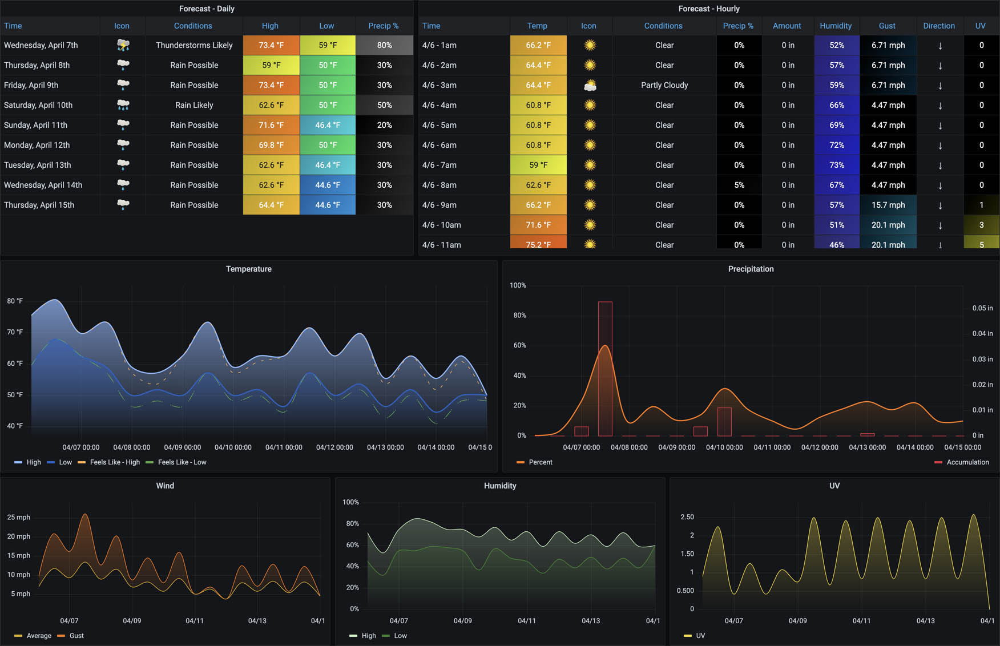

## About The Project

**weatherflow-listener** is a set of scripts that provide different ways of collecting and publishing data from the [WeatherFlow Tempest](https://weatherflow.com/tempest-weather-system/) weather system and visualize that data with Grafana dashboards. 

There are several different collector types available once you deploy your  WeatherFlow device:

 - Local: UDP Collector
 - Remote: WeatherFlow API

## Getting Started

The project builds a pre-configured Docker container that takes different configurations based on how you want to collect and where you want to store the data.

## Prerequisites

- [Docker](https://docs.docker.com/install)
- [Docker Compose](https://docs.docker.com/compose/install)
- [InfluxDB 1.8](https://docs.influxdata.com/influxdb/v1.8/) or [Grafana Loki 2.2](https://grafana.com/oss/loki/)

## Notice

Like all projects - weatherflow-listener is always in a flux state based on trying out new things and seeing what works and what doesn't work. It started as a fun exercise to visualize "what's possible," and I'm experimenting with different collectors and backends. Please expect breaking changes along the way.

## Using

There's an example [docker-compose.yml](https://github.com/lux4rd0/weatherflow-listener/blob/main/docker-compose-sample.yml) file that you should update the environmental flags for your specific collection and databases.

Use the following [Docker container](https://hub.docker.com/r/lux4rd0/weatherflow-listener):

    lux4rd0/weatherflow-listener:2.0.0

Environmental flags:

```WEATHERFLOW_LISTENER_BACKEND_TYPE```

- influxdb (supports local-udp, remote-rest (forecasts), and remote-socket (observations)
- loki (supports local-udp and remote-socket (observations)

```WEATHERFLOW_LISTENER_COLLECTOR_TYPE```

- [remote-socket](https://weatherflow.github.io/Tempest/api/ws.html)
- [local-udp](https://weatherflow.github.io/Tempest/api/udp.html)
- [remote-rest](https://weatherflow.github.io/Tempest/api/swagger/)

```WEATHERFLOW_LISTENER_DEBUG```

- true
- false

```WEATHERFLOW_LISTENER_INFLUXDB_PASSWORD```

The password for your InfluxDB

```WEATHERFLOW_LISTENER_INFLUXDB_URL```

The URL connection string for your InfluxDB. For example: http://influxdb:8086/write?db=weatherflow

```WEATHERFLOW_LISTENER_INFLUXDB_USERNAME```

The username of your InfluxDB

```WEATHERFLOW_LISTENER_REMOTE_COLLECTOR_DEVICE_ID```

The Device ID of your Tempest

```WEATHERFLOW_LISTENER_REMOTE_COLLECTOR_STATION_ID```

The Station ID of your Tempest

```WEATHERFLOW_LISTENER_REMOTE_COLLECTOR_TOKEN```

The WeatherFlow Personal Access Token.

```WEATHERFLOW_LISTENER_LOKI_CLIENT_URL```

The URL connection string for your Grafana Loki endpoint. For example: http://loki:3100/loki/api/v1/push

If you want to just run a single instance, for example - the forecast collector, a docker command would look like:

    docker run -d \
      --name=weatherflow-listener-remote-rest-influxdb \
      --restart always \
      -e WEATHERFLOW_LISTENER_BACKEND_TYPE=influxdb \
      -e WEATHERFLOW_LISTENER_COLLECTOR_TYPE=remote-rest \
      -e WEATHERFLOW_LISTENER_DEBUG=false \
      -e WEATHERFLOW_LISTENER_INFLUXDB_PASSWORD=PASSWORD \
      -e WEATHERFLOW_LISTENER_INFLUXDB_URL=http://influxdb:8086/write?db=weatherflow \
      -e WEATHERFLOW_LISTENER_INFLUXDB_USERNAME=influxdb \
      -e WEATHERFLOW_LISTENER_REMOTE_COLLECTOR_DEVICE_ID=DEVICE_ID \
      -e WEATHERFLOW_LISTENER_REMOTE_COLLECTOR_STATION_ID=STATION_ID \
      -e WEATHERFLOW_LISTENER_REMOTE_COLLECTOR_TOKEN=TOKEN \
      lux4rd0/weatherflow-listener:2.0.0

## Obtaining Your Tempest API Details

 You can obtain this by signing in to the Tempest Web App at tempestwx.com, then go to Settings -> Data Authorizations -> Create Token.

### Get Station Meta Data

Retrieve a list of your stations along with all connected devices.

https://swd.weatherflow.com/swd/rest/stations?token=[your_access_token]

A quick jq command to find your station_id and device_id would look like:

#### STATION_ID

    curl https://swd.weatherflow.com/swd/rest/stations?token=[your_access_token] | jq .stations[0].station_id

#### DEVICE_ID

    curl https://swd.weatherflow.com/swd/rest/stations?token=[your_access_token] | jq .stations[0].devices[1].device_id

If you have multiple Tempest devices connected to multiple hubs, use .stations[1], etc., for each station under your account.

## Collector Details

#### remote-socket

This setting grabs all of the metrics from your Tempest and all of the [derived metrics](https://weatherflow.github.io/Tempest/api/derived-metric-formulas.html), accomplished with WeatherFlow backend AI systems. The metrics don't have the same metrics resolution as the local-udp collector but supports lightning suppression and sea level pressure adjustments. It also provides for additional events such as online and offline status. This setting works with both Grafana Loki and InfluxDB 1.8.

#### local-udp

This setting provides a listener on UDP port 50222 for messages coming from your Tempest hub. It provides all of the raw observation details and details on the Hub and Tempest, such as RSSI Wifi details, uptime, sensor details, and device battery voltage. The observation metrics have a slightly higher resolution of data than what the REST/Socket API calls provide. However, it does not give any of the [derived metrics](https://weatherflow.github.io/Tempest/api/derived-metric-formulas.html) available with the REST/Socket API calls. This setting works with both Grafana Loki and InfluxDB 1.8.

#### remote-rest

This setting populates the WeatherFlow Forecast dashboards. It makes a Web services call to pull the daily and hourly forecasts for your location and stores them in InfluxDB. It runs the forecasting process on startup and every 60 minutes after the start of the container. This setting works only works with InfluxDB 1.8.


## Grafana Dashboards

Collecting data is only half the fun. Now it's time to build out some Grafana Dashboards to visualize all of our great WeatherFlow data. You'll find a [folder of dashboards](https://github.com/lux4rd0/weatherflow-listener/tree/main/dashboards) that collector and backends split out.

The "**WeatherFlow - Overview**" dashboard is the starting point with a listing of Current observations along with historical details..

Other dashboards can be viewed by selecting the "WeatherFlow" drop-down from the top righthand side of the dashboards:

<center></center>

There are different dashboards for **local-udp** and **remote-rest**.

**WeatherFlow - Today So Far**

<center></center>

Temperature, Relative Humidity, Station Pressure, Accumulated Rain, Solar Radiation, Illuminance, UV, Lightening Strike, and Wind Speed since midnight. Rapid Wind Direction and Wind Speed over the last 60 seconds is also updated every 5 seconds (by default).

There are different dashboards for **local-udp** and **remote-rest** collectors.


**WeatherFlow - Forecast**

<center></center>

The Forecast dashboard provides both a daily and hourly forecast in table format with charts below them. The default time range includes the current day plus nine coming days. The interval drop-down at the top defaults to 12 hours to provide for highs and lows forecasts.

This dashboard uses the **remote-rest** collector and **InfluxDB** backend.

**WeatherFlow - Forecast vs. Observed**

A comparisons of data that was forecasted overlayed with historic observations.

This dashboard uses the **remote-rest** collectors with the **InfluxDB** backend.

**WeatherFlow - Device Details**

<center></center>

Provides the current status for both the Tempest and WeatherFlow hub such as Uptime, Radio Status, RSSI, Reboot Count, I2C Bus Count Error, Radio Version, Network ID, Firmware Version, and Voltage.

<center></center>

Another panel provides an overview of Sensor Status measurements - either "Sensors OK" or if there were any failures.

<center></center>

There's also RSSI and Battery Voltage over time defaulted to the last seven days.

<center></center>
<center></center>

This dashboard uses the **local-udp** collector.

## Downloading WeatherFlow Grafana Dashboards Individually

The dashboards included in this WeatherFlow Dashboards AIO stack can also be downloaded separately if so desired:

- [WeatherFlow - Overview](https://grafana.com/grafana/dashboards/13938)
- [WeatherFlow - Today So Far](https://grafana.com/grafana/dashboards/13939)
- [WeatherFlow - Device Details](https://grafana.com/grafana/dashboards/13940)

## Roadmap

See the open issues for a list of proposed features (and known issues).

## Contact

Dave Schmid - [@lux4rd0](https://twitter.com/lux4rd0) - dave@pulpfree.org
Project Link: https://github.com/lux4rd0/weatherflow-listener

## Acknowledgements

- Grafana Labs - https://grafana.com/
- Grafana - https://grafana.com/oss/grafana/
- Grafana Dashboard Community - https://grafana.com/grafana/dashboards
